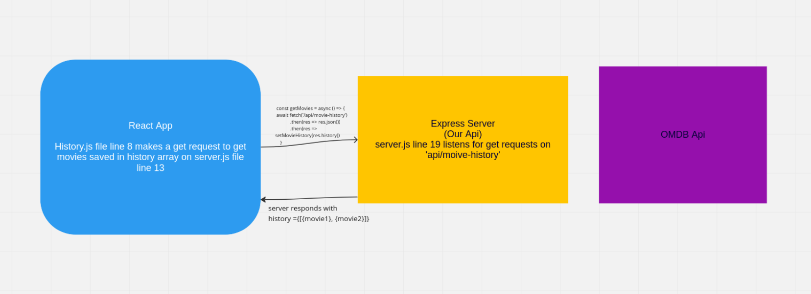
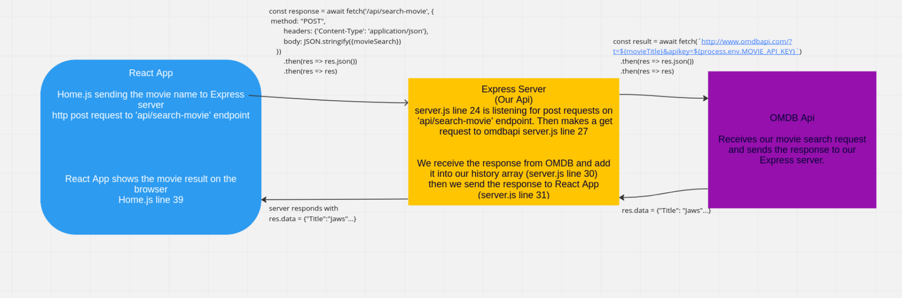

# Detailed explanation of the App

## Quick Cheatsheet 

<details><summary><b>How to create a React app:</b></summary>

on the terminal run the command below, change <name of your app> the name that you want. Do not use arrows as you put the name you want etc `npx create-react-app movie-app`

```shell
npx create-react-app <name of your app>
```

to install any dependency use `npm install` or `npm i` followed by the package you want to install

for example to install `react-router-dom` use this: 

```shell
npm i react-router-dom
```

if you are going to make http requests to a server that is also running on your local machine, you need to add the following setting in to your `package.json` file in your React app:

```JSON
"proxy": "http://localhost:3001"
```
<details><summary><b>the file should look like this:</b></summary>

```JSON
{
  "name": "todo-list-app",
  "version": "0.1.0",
  "private": true,
  "dependencies": {
    "@emotion/react": "^11.10.5",
    "@emotion/styled": "^11.10.5",
    "@mui/material": "^5.10.15",
    "@testing-library/jest-dom": "^5.16.5",
    "@testing-library/react": "^13.4.0",
    "@testing-library/user-event": "^13.5.0",
    "formik": "^2.2.9",
    "react": "^18.2.0",
    "react-dom": "^18.2.0",
    "react-router-dom": "^6.4.3",
    "react-scripts": "5.0.1",
    "styled-components": "^5.3.6",
    "web-vitals": "^2.1.4"
  },
  "scripts": {
    "start": "react-scripts start",
    "build": "react-scripts build",
    "test": "react-scripts test",
    "eject": "react-scripts eject"
  },
  "eslintConfig": {
    "extends": [
      "react-app",
      "react-app/jest"
    ]
  },
  "browserslist": {
    "production": [
      ">0.2%",
      "not dead",
      "not op_mini all"
    ],
    "development": [
      "last 1 chrome version",
      "last 1 firefox version",
      "last 1 safari version"
    ]
  },
  "proxy": "http://localhost:3001"
}
```
</details>

<br />

to start your react app in development mode 

```shell
npm start
```
</details>

<details><summary><b>How to create an Express app:</b></summary>

On your terminal navigate to the folder you want to create your node project in. 

For example

```shell
cd Documents/GA/express_app
```

Then initialise an npm app wit the command below

```shell
npm init -y
```

In order to be able to restart the express app each time you make a change on the files install `nodemon` node package. 
This is a package that we will only need while we are developing the app so let's install it as follows

```shell
npm i nodemon --save-dev
```

Then add a new start script to your `package.json` file in the express app. 

Make sure that your start script has `"dev":"nodemon server.js"`

```JSON
"scripts": {
    "start": "node server.js",
    "dev": "nodemon server.js",
    "test": "echo \"Error: no test specified\" && exit 1"
  },
```

Now when you want to start your Express app for development purposes run:

```shell
npm run dev
```

<strong>IMPORTANT:</strong>  Make sure that your starting script is named same as what you put on your `package.json` file.

In this example we called our entry point file `server.js` therefore we changed the `package.json` file accordingly. 

Finally Install Express pacakge:
```shell
npm i express
```


</details>

<br />
<br />


## React Folder Structure
<ul>
    <li>
        We created every page as a component [page, about, history etc]
    </li>
    <li>
        We created every small piece that might be put on a page as a componenet such as paragraphs, navbar, movie information etc.
    </li>
</ul>

<br />

## Passing props from Parent --> Children

We need to pass state variables, from parent component to child component. 

Official documentation is [here](https://reactjs.org/docs/lifting-state-up.html)

<br />

## Flow of operations

### 1 -)

When you click on the history button on React App, we load the History (History.js) component.

History component has a `useEffect()` function that runs each time the History component mounts. 

Inside the `useEffect()` funtion we make a http get request to our own server to get movie search history. And we are running the `setMovieHistory()`function to change the current `movieHistory` variable with the response we get from the server.

```javascript
const [movieHistory, setMovieHistory] = useState(null)
    const getMovies = async () => {
        await fetch('/api/movie-history')
            .then(res => res.json())
            .then(res => setMovieHistory(res.history))
    }
```



### 2 -)

On the home screen when we click on the search button we are capturing the entry our user made in the input field

```javascript
const form = e.target
const movieSearch = Object.fromEntries(new FormData(form))
```

Then we are sending the name of the movie to our own Express server inside a http `POST` request.

```javascript
const handleSubmit = async (e) => {
    e.preventDefault()
    const form = e.target
    const movieSearch = Object.fromEntries(new FormData(form))

    const response = await fetch('/api/search-movie', {
        method: "POST",
        headers: {'Content-Type': 'application/json'},
        body: JSON.stringify({movieSearch})
    })
        .then(res => res.json())
        .then(res => res)
    // console.log(response)
    setMovieInformation(response.result)
}
```

We are only sending the name of the movie that we captured from submit input. 
On the Express server side, `server.js` line 24 we are waiting for a post request on the same url end point `/api/search-movie`.

Then on `server.js` line 27 we are making a http get request to omdbapi with the movie name we received from the react app. 

```javascript
const result =  await fetch(`http://www.omdbapi.com/?t=${movieTitle}&apikey=${process.env.MOVIE_API_KEY}`)
    .then(res => res.json())
    .then(res => res)
```

when we receieved the response from omdbapi firstly we are saving it as an element in the history array `server.js` line 30. Then we are sending the response to React App on `server.js` line 31.

